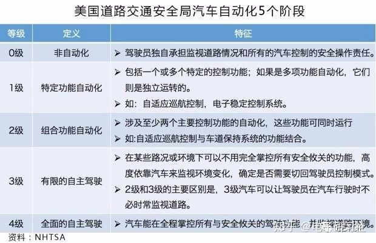

title: ADAS-先进驾驶辅助系统
date: 2019-04-12 11:50:54
tags: [AI, ADAS, 自动驾驶]
categories: AI
---
# ADAS-先进驾驶辅助系统
本文转自：[一文看懂ADAS](https://zhuanlan.zhihu.com/p/36903822)

索引：

[TOC]
## 概述
先进驾驶辅助系统（Advanced Driver Assistant System），简称ADAS，是利用安装于车上的各式各样的传感器， 在第一时间收集车内外的环境数据， 进行静、动态物体的辨识、侦测与追踪等技术上的处理， 从而能够让驾驶者在最快的时间察觉可能发生的危险， 以引起注意和提高安全性的主动安全技术。
我们来看一张美国道路交通安全局（NHTSA）所发布的汽车自动化阶段图：

ADAS实现的是第3级，而自动驾驶实现的是第4级。想要从第3级发展到第4级，还需要更多的汽车上配有自动驾驶技术，而且得配合道路基础设施建设（道路上的摄像头，清晰的车道线），以及需要汽车互联，汽车手机互联等等，是个非常庞大的工程呐。
<!--more-->
## ADAS系统的子系统
1. 导航
2. 实时交通系统TMC
3. 电子警察系统ISA （Intelligent speed adaptation或intelligent speed advice）
4. 车联网（Vehicularcommunication systems）
5. 自适应巡航ACC（Adaptivecruise control）
6. 车道偏移报警系统LDWS（ Lanedeparture warning system）
7. 车道保持系统（Lanechange assistance）
8. 碰撞避免或预碰撞系统（Collision avoidance system或Precrash system）
9. 夜视系统（Night Vision）
10. 自适应灯光控制（Adaptivelight control）
11. 行人保护系统（Pedestrian protectionsystem）
12. 自动泊车系统（Automatic parking）
13. 交通标志识别（Traffic sign recognition）
14. 盲点探测（ Blind spot detection）
15. 驾驶员疲劳探测（Driverdrowsiness detection）
16. 下坡控制系统（Hill descentcontrol）
17. 电动汽车报警（Electric vehicle warningsounds）系统
